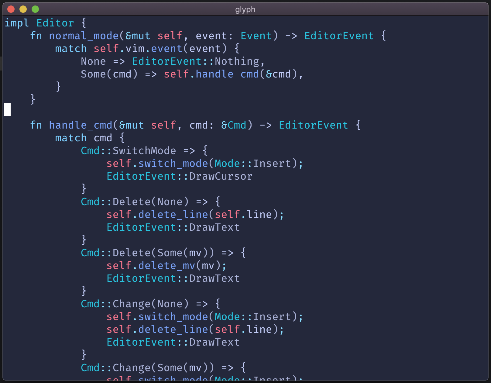

# Glyph

This is my personal code editor that I am building for fun and to get more familiar with OpenGL.

Glyph currently supports Vim keybinds, syntax highlighting, and runs at a consistent and smooth ~100 FPS. Eventually Glyph will have LSP support and become my main editor.

Glyph is designed for my own personal use, as a result I've made engineering and design decisions that suit only my own needs. The code is also meant to be read only by me, but can still be a useful starting point for others who wish to build their own code editor.

[I'm writing about the engineering process here](https://zackoverflow.dev), where I talk about some of the technical details of building Glyph.
